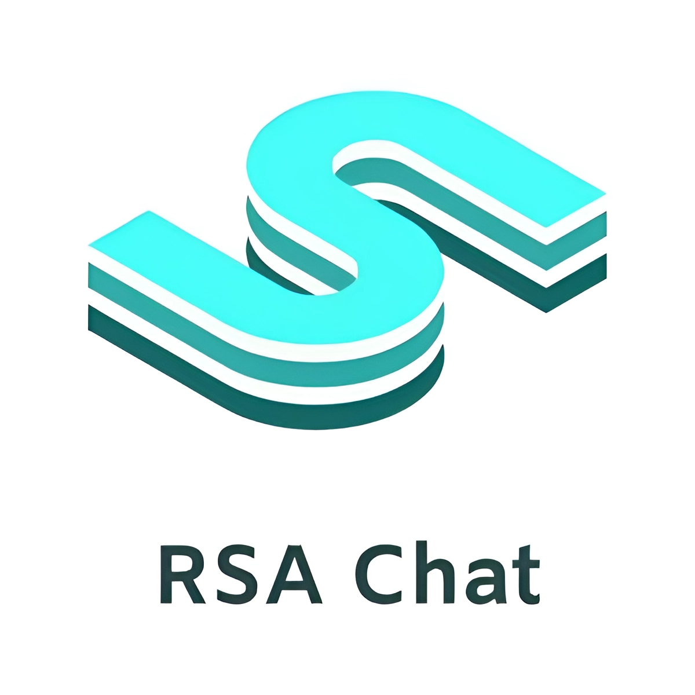

# RSA-chat

Nowadays, the problem of information leakage is very relevant. This chat uses the RSA encryption algorithm and prevents unwanted data leaks.

## Getting Started
These instructions will get you a copy of the project up and running on your local machine for development and testing purposes. See deployment for notes on how to deploy the project on a live system.

### Prerequisites
You will need to install python 3.10.8 for further software installation if you don't want to use a virtual environment or don't have Python installed at all

+ **[Windows installer (64-bit)](https://www.python.org/ftp/python/3.10.8/python-3.10.8-amd64.exe)**
+ **[Windows installer (32-bit)](https://www.python.org/ftp/python/3.10.8/python-3.10.8.exe)**
+ **[macOS 64-bit universial2 installer (for macOS 10.9 and later)](https://www.python.org/ftp/python/3.10.8/python-3.10.8-macos11.pkg)**
+ **[Python official website](https://www.python.org/downloads/release/python-3108/)**

### Installing
Click the "Code" button, which is located in the upper left corner above this repository, and then click on the "Download ZIP" button and unzip the downloaded archive.
Then you need to install the required libraries (see **requirements.txt** file). I recommend installing them in a virtual environment. To do this, in the console, go to the directory where you unzipped this repository and write:
```
python -m venv venv
```

After which you will have a virtual environment. Then you need to install the libraries from requirements.txt (You must be in the directory with the requirements.txt file):
```
pip install -r requirements.txt
```

### Instructions for use
1. Start the server (launched via the **server.bat** file). Enter the ip and port on which you want to start the server (if you want to leave everything as default, enter 0). *Tell your interlocutor the ip and port of the server.*
2. Run client.py and go to **settings**. There is a button **generate files**. Enter the server ip and port (visible in the server window) and click generate files. *Your interlocutor should do the same*.
3. Обменяйтесь папками **public**.
4. Go back to settings and click on the "Connect" button. There you will also have to enter the ip and port of the server. Return to the main screen. ***Everything is ready, you can communicate!!!***

## Authors
+ **Balitskii Maksim** - *initial work* - [balimaksim](https://github.com/balimaksim)

## License
This porject is licensed under [License](https://github.com/balimaksim/RSA-chat/blob/main/LICENSE.md) file for 

## Acknowledgments
+ Thanks to my supervisor and computer science teacher for their help in creating this project.